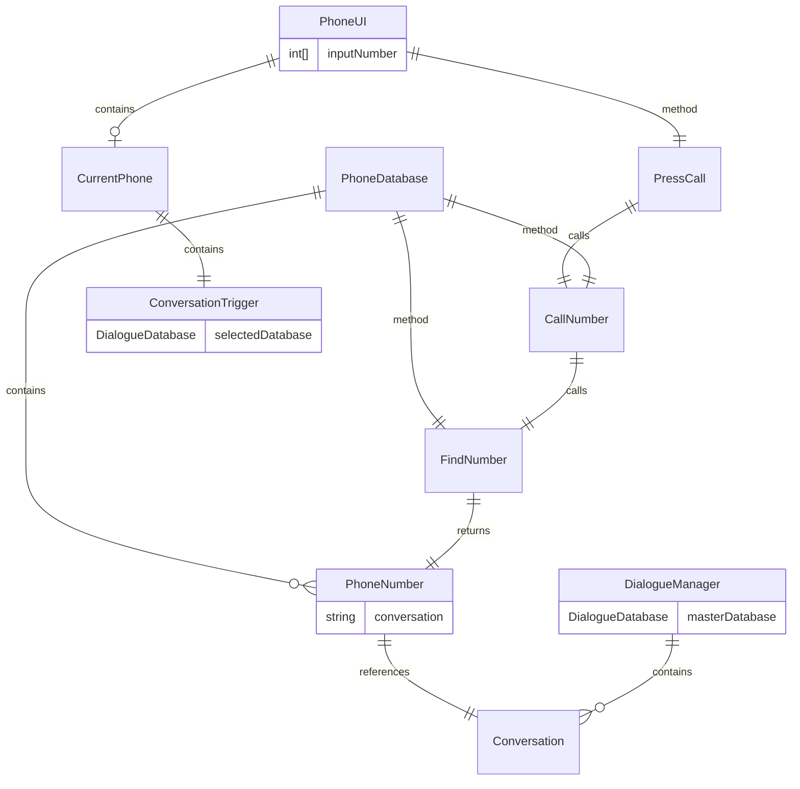

# Telephony

```mermaid
erDiagram
    PhoneUI {
        int[] inputNumber
    }
    PhoneUI ||--o| CurrentPhone : contains
    PhoneUI ||--|| PressCall : method
    PressCall ||--|| CallNumber : calls
    PhoneDatabase ||--o{ PhoneNumber : contains
    PhoneDatabase ||--|| CallNumber : method
    PhoneDatabase ||--|| FindNumber : method
    CallNumber ||--|| FindNumber : calls
    FindNumber ||--|| PhoneNumber : returns
    PhoneNumber {
        string conversation
    }
    PhoneNumber ||--|| Conversation : references
    CurrentPhone ||--|| ConversationTrigger : contains
    ConversationTrigger {
        DialogueDatabase selectedDatabase
    }
    DialogueManager {
        DialogueDatabase masterDatabase
    }
    DialogueManager ||--o{ Conversation : contains
```
